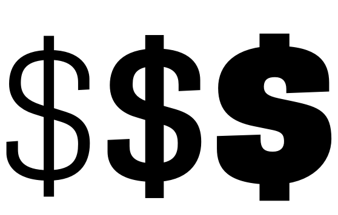
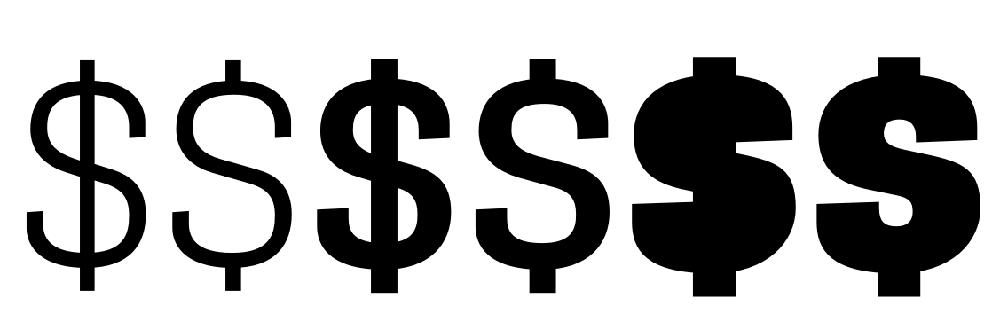

## Preparation for variable fonts
### Setting up Axes


Axes are the parameters that the variable font will vary upon. From these we have 5 registered axes that are documented [here](https://docs.microsoft.com/en-us/typography/opentype/spec/dvaraxisreg). 

Some basics on registered axes, their names, tags and recommended values.

- Name: **Weight**
 Tag: `'wght'`
 Valid numeric range: Values must be in the range 1 to 1000. Recommended or required “Regular” value: 400 is required

- Name: **Width**
 Tag: `'wdth'`
 Valid numeric range: Values must be strictly greater than zero, recommended or required “Regular” value: 100 is required

- Name: **Italic**
 Tag: `'ital'`
 Valid numeric range: Values must be in the range 0 to 1

- Name: **Slant**
 Tag: `'slnt'`
 Valid numeric range: Values must be greater than -90 and less than +90.

- Name: **Optical size**
 Tag: `'opsz'`
 Valid numeric range: Values must be strictly greater than zero, values can be interpreted as text size, in points. Recommended or required “Regular” value: A value in the range 9 to 13 is recommended.

Apart from the registered axes we have the option of using unregistered axes. The name of the custom axes could be anything we want but the TAG should be again a 4 letter combination but this time in **uppercase**. 

### Setting up Masters

All glyphs must be compatible across the masters. Even if applications don't report incompatibilities, `fonttools` may still do so :) An incompatibility report from `fonttools` might mean one of the following:
	
1. segments that don't have the same number of off-curve BCPs
2. glyphs that have different number of anchors across masters
3. overlapping points that are not consistent across all masters

### Setting up the DesignSpace

A DesignSpace is a document that contains all the definitions about axes, master files, instances etc. We give them the extension `.designspace` and we can make them with [Superpolator](http://superpolator.com), [DesignSpaceEditor](https://github.com/LettError/designSpaceRoboFontExtension), and by hand :)
The structure is fairly simple, here is an example of a design space with two masters on a weight axis.

```xml
<?xml version='1.0' encoding='utf-8'?>
<designspace format="3">

    <!-- specify axes -->
    <axes>
        <!-- one axis for weight parameter that runs from 0 to 1000 with default location=0 -->
        <axis default="0" maximum="1000" minimum="0" name="weight" tag="wght" />
	</axes>

	<!-- specify masters -->
    <sources>

        <!-- first master, FamilyLight.ufo that sits on the weight axis on location=0 -->        
		<source familyname="Family" filename="FamilyLight.ufo" stylename="Light">
            <location>
                <dimension name="weight" xvalue="0" />
            </location>
        </source>

        <!-- second master, FamilyBold.ufo that sits on the weight axis on location=1000 -->
        <source familyname="Family" filename="FamilyBold.ufo" stylename="Bold">
            <location>
                <dimension name="weight" xvalue="1000" />
            </location>
        </source>
    
    </sources>

</designspace>

```


More in depth info:
[DesignSpaceDocument Specification](https://github.com/fonttools/fonttools/tree/master/Doc/source/designspaceLib)

### Generating the Variable Font

A great guide [I can variable font](https://github.com/scribbletone/i-can-variable-font) by [Travis Kochel
](https://github.com/scribbletone) published a month after the announcement of variable fonts. It contains info on how to install fontmake, the command line tool for generating the variable ttf.

Quick reference:

`fontmake -o variable -m pathToDesignspaceFile`

This makes a bunch of TTF compatible masters and a final variable TTF, based on our UFO sources and `.designspace` file.


### What are Variation Alternates

There are many occasions that a specific glyph has an alternative design for a narrower or a bolder version.

The experimental [”rules”](http://new.superpolator.com/documentation/rules/) feature of Superpolator is, in my opinion, the most useful tool to visualise these glyph substitutions and understand their location in the design space.

e.g.




	Protipo-Light has a dollar with a vertical stroke
	Protipo-Medium has a dollar with a vertical stroke
	Protipo-ExtraBold has a dollar without a vertical stroke


OpenType Font Variations supports the selection of alternate glyphs for **particular regions** of the design space.
	This is accessible through the `'rvrn'` OpenType feature that, like all glyph substitutions, is stored in the GSUB table. 

To control these substitutions we add the FeatureVariations conditions subtable that defines when these switches take place, e.g. how bold our font needs to be so a non-stroke dollar can replace a stroke one.

FeatureVariations conditions can work on more than one axis. They can have multiple conditions to operate at the same time.

### Setting up Variation Alternates

Here is how to set these switches:

- First we design the extra glyphs :) one for each design and just like everything else these alternate glyphs need to be compatible across the masters. The great thing is that these alternates **DO NOT** need to be compatible with the default glyphs.  




- Secondly we need to set up the `'rvrn'` feature. The [rvrn feature](https://docs.microsoft.com/en-us/typography/opentype/spec/features_pt#tag-rvrn) is on by default and together with the Feature variation conditions will make the switch. According to the spec this feature has zero lookups: 
> The `'rvrn'` feature is mandatory: it should be active by default and not directly exposed to user control… Typically, a FeatureTable referenced in a FeatureRecord with the 'rvrn' tag will have LookupCount set to 0; in this way, the default variation instance does not have any glyph substitution applied but, rather, uses default glyphs…

Practically that would mean that inside our OTfeature definition file we should have:

```
feature rvrn {
} rvrn;
```

Unfortunately an ”empty” feature doesn't manage to stay in the font. So we can add a “reset” lookup (Adobe's Prototype method) or anything for that matter in order the feature is preserved in our font. We can delete this hack later in the TTXed version of the GSUB. For example:

```
feature rvrn {
	sub Q.alt by Q;
} rvrn;
```


Back to more normal things, in our sources files we group our substitutions into lookups:

```
lookup RVRN {
    sub Q by Q.alt;
    sub dollar by dollar.alt;
} RVRN;
```

If our glyphs are switching in a different moment on the axis we put them in different lookups.

```
lookup RVRN1 {
    sub Q by Q.alt;
} RVRN1;

lookup RVRN2 {
    sub dollar by dollar.alt;
} RVRN2;
```

At this point we proceed normally and we generate a variable font with fontmaker command.

### Setting up the FeatureVariations conditions
The variable font that we have has all the ingredients to support glyph substitutions apart from the conditions subtable.

- first we start by TTXing the hell out of it and we extract only the GSUB:

`ttx -t GSUB myVAR.TTF`

- We open the GSUB in a text editor and first we “empty” the `'rvrn'` feature:

```xml
<FeatureRecord index="14">
	<FeatureTag value="rvrn"/>
	<Feature>
	</Feature>
</FeatureRecord>
```
NOTE: `index="14"` represents the value that 'rvrn' feature is ordered in the specific font. This value is of course different in every font. We will use the value later in the Conditions.

- then at the end of our GSUB we add the feature variation subtable

e.g.

```xml
<FeatureVariations>
      <Version value="0x00010000"/>
      <FeatureVariationRecord index="0">
        <ConditionSet>
          <!-- ConditionCount=1 -->
          <ConditionTable index="0" Format="1">
            <AxisIndex value="0"/>
            <FilterRangeMinValue value="0.12"/>
            <FilterRangeMaxValue value="0.24"/>
          </ConditionTable>
        </ConditionSet>
        <FeatureTableSubstitution>
          <Version value="0x00010000"/>
          <!-- SubstitutionCount=1 -->
          <SubstitutionRecord index="0">
            <FeatureIndex value="14"/>
            <Feature>
              <!-- LookupCount=1 -->
              <LookupListIndex index="0" value="57"/>
            </Feature>
          </SubstitutionRecord>
        </FeatureTableSubstitution>
      </FeatureVariationRecord>
</FeatureVariations>
```

- **AxisIndex** is the number of the axis. This is the order number that we can find in the .designspace and the fvar table. 
In this example `<AxisIndex value="0"/>` is weight
- **FilterRanges** are the values of where our substitutions are active . In this example

```xml
	<FilterRangeMinValue value="0.12"/>
	<FilterRangeMaxValue value="0.24"/>
```
The switch is happening between 0.12-0.24 on the weight axis.

- **FeatureIndex** value is the ID number of the 'rvrn' feature. In this example `<FeatureIndex value="14"/>`

- **Lookuplist** is the number of the lookup that represents the substitution groups`<Lookup index="57">`


The [condition table](https://docs.microsoft.com/en-us/typography/opentype/spec/chapter2#condition-table) uses  a normalized scale with minimum -1, default 0 and maximum 1. 
In the “rules” in our Superpolator document, we used the concerned axis value to set our substitution. Now we have to convert the “switching” values to a scale from -1 to 1, with default always to 0.

For a weight axis 0 to 1000, with the default at 0 our ”jump” was happening between 120 - 240. So in our new scale 0.12-0.24.

###The biggest secret of all
In order for this new GSUB to run we need to update the version number! The GSUB version that we get from `fontmake` is:

```
    <GSUB>
        <Version value="0x00010000"/>
```

   
   
This one doesn't do the flip so we need to update it to:
    
```
    <GSUB>
        <Version value="0x00010001"/>
```

- We update the GSUB in our TTF

    `ttx -m myVAR.TTF GSUB.ttx`

And voilà ✊

---

## extra stuff

Microsoft hosts a [Github repository](https://github.com/Microsoft/OpenTypeDesignVariationAxisTags) that is used for discussion and review of proposals for registration of OpenType design-variation axis tags. It includes a [Proposal Summary Form](https://github.com/Microsoft/OpenTypeDesignVariationAxisTags/blob/master/Proposals/ProposalSummary.md) and all the needed information about submissions.
[Here](https://github.com/Microsoft/OpenTypeDesignVariationAxisTags/tree/master/Proposals)you can find all the submitted proposals till now, including [Glyph Extension](https://github.com/Microsoft/OpenTypeDesignVariationAxisTags/blob/master/Proposals/Glyph_Extension_Axis/ProposalSummary.md) by [Sahar Afshar](https://github.com/sahafshar) and [José Solé](https://github.com/jmsole) and [TypeNetwork](https://github.com/TypeNetwork)'s [Parametric Axes
](https://github.com/Microsoft/OpenTypeDesignVariationAxisTags/tree/master/Proposals/TypeNetwork_ParametricAxes) that can be seen also [here](https://variationsguide.typenetwork.com).

TO ADD: full list of variable fonts with jumps
